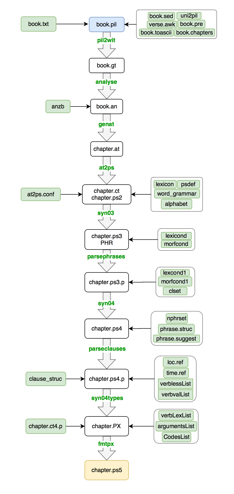
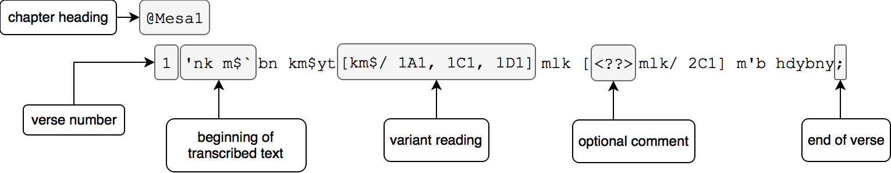
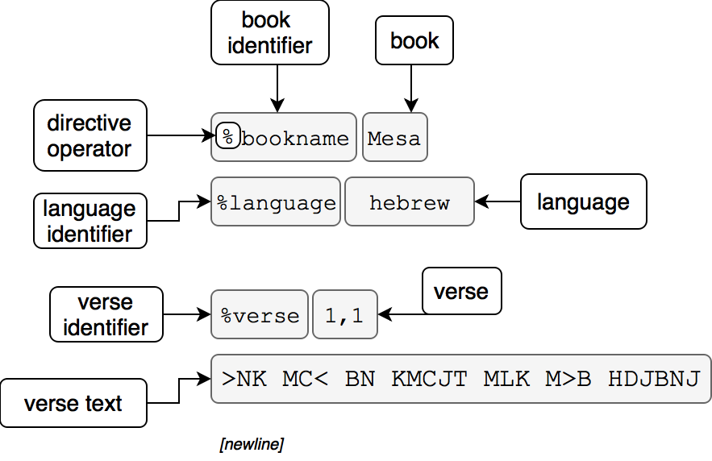
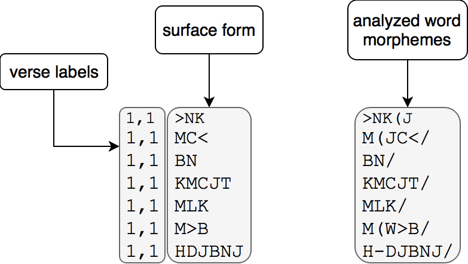
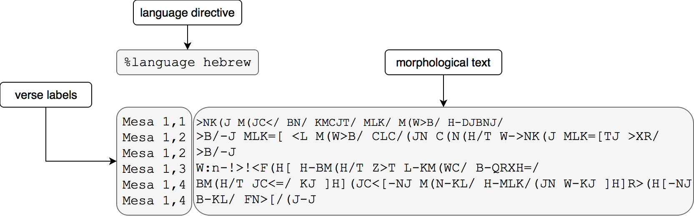
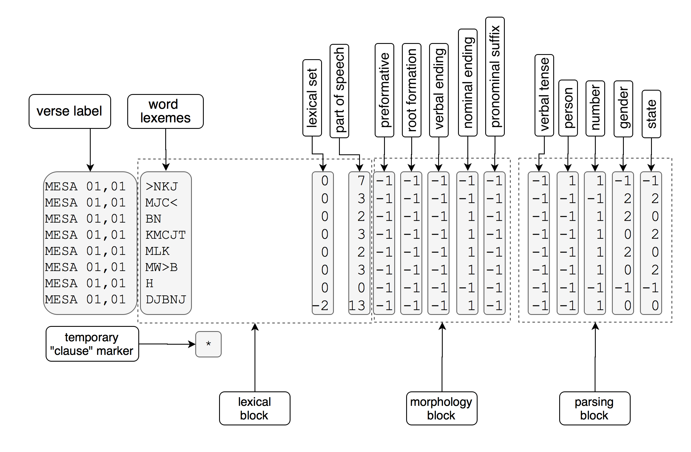
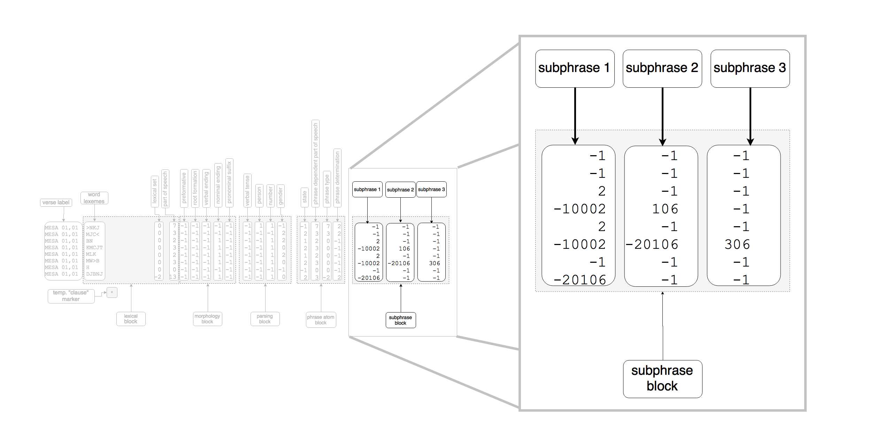

# ETCBC Text Conversion Process
In the following sections, I describe the ETCBC text conversion process from the beginning stages of converting a document into its machine-readable format all the way up to its fully encoded representations. 

<br>
<br>
<br><br>
<br>
<br><br>
<br>
<br><br>
<br><br>
<br>
<br><br>
<br>
<br><br>
<br>
<br>
<br>
<br><br>
<br>
<br><br>
<br>
<br><br>
<br>
<br>
<br>
<br>
<br>

## ETCBC Data Creation Pipeline
<figure >

<figcaption>ETCBC Data Creation Pipeline</figcaption>
</figure>
<br>
This diagram depicts the pipeline in the ETCBC's data creation process. The pipeline can vary from project to project, and has changed over the years. The pipeline presented above represents a version used during the recent project on syntactic variation. The top level file, `book.pil`, contains the starting point for the process. The files below it in white (one in gold) make up the analysis files that hold and transmit the analyzed data. In the chart, green represents part of a process. Those processes are initiated with the commands indicated in green text in the center arrows (e.g. <span style='color:green'>**pil2wit**</span>, <span style='color:green'>**analyse**</span>, etc.). Green boxes represent files utilized by the processes. The process files on the right are ported in from central locations on the server with UNIX commands like `sccs`. The process files on the left are generated by the pipeline itself. 

## 1. Analysis Files
Each analysis file represents a stage in the data creation process, progressing from word-level to phrase and clause-levels. Analysis files are plain text, and are frequently operated on with additional UNIX commands (e.g. `sed`, `awk`, `sort`, etc.) not reflected here (to see examples, view the [example Makefile](). 

Each file description below contains: <br>
**1.** the command/location to view documentation in the ETCBC server<br>
**2.** a sample of the file selected from the ETCBC encoding of the [Mesha Inscription](https://en.wikipedia.org/wiki/Mesha_Stele) (Hebrew/Moabite)<br>
**3.** a diagram of the specific parts of the file. 

### 1.1 Raw Text Analysis

#### .pil
The .pil ("Peshitta Institute of Leiden") file is the first step in entering an ancient text into a computer-readable format. It contains the chapter and verse boundaries, transcription of the document text, and notations of variants/reconstructions found in other witnesses. The file also supports the notation of lacunae and fragmentary readings in a text.

The .pil file is generated by processing a plain text document, perhaps with the original utf8 characters copied and pasted from an original source (`book.txt` in the diagram above).

##### Source
plain text file, perhaps in unicode, processed into .pil format with `sed`, `awk`, `cat`, or other UNIX text processing commands

##### Documentation
[Format of a PIL Running Text File](pil_documentation.pdf) or<br>
`/projects/calap/doc/format/format.pdf`

##### Sample
```
@Mesa1
 1 'nk m$` bn km$yt  [km$/ 1A1, 1C1, 1D1] mlk [<??>mlk/ 2C1] m'b hdybny;
 2 'by mlk `l m'b $l$n $t w'nk mlkty 'Hr 'by;
 3 w'`$ hbmt z't lkm$ bqrHh;
 4 bmt y$` [bm<???>$`/ 1A1, 1D1] [b<????>$`/ 1C1] ky h$`ny mkl hmlkn
     wky hr'ny bkl $n'y;
 5 `mry mlk y$r'l wy`nw 't m'b ymn rbn ky y'np km$ b'rSh;
 ...
```
##### Parts

<figure >

<figcaption>lines 1-2 of Mesa.pil</figcaption>
</figure>

A more detailed description for each of these elements and some others, as well as the formatting rules for a .pil file, is in the documentation, [Format of a PIL](). 

#### .gt 
The .gt ("graphical text") file contains a cleaned version of the plain text document, stripped of its .pil notations and transliterated into the [ETCBC transliteration](https://shebanq.ancient-data.org/shebanq/static/docs/ETCBC4-transcription.pdf). The file also contains "directives" or markers for the document's language, book name, and verse labels. 

Each row of text is preceded on the line above it with a verse header (`%verse n,n`). A blank newline separates individual verses.

The .gt file extension is sometimes omitted.

##### Source
generated by `pil2wit`

#####Documentation:
 `man -s5 gt`

#####Sample 
```
%bookname Mesa
%language hebrew

%verse 1,1
>NK MC< BN KMCJT MLK M>B HDJBNJ

%verse 1,2
>BJ MLK <L M>B CLCN CT W>NK MLKTJ >XR >BJ
...
```

#####Parts
<figure >

<figcaption>header and verse 1 of Mesa.gt</figcaption>
</figure>

Comments in a .gt file are prefixed with `#`.

### 1.2 Morphological Analysis

#### .an
The .an ("analysis") file breaks down the individual words into their morphological parts: prefix, core (the lexeme), infix (morphemes within the lexeme), suffix. The various morphemes are separated with characters. For instance, a prefix is set between exclamation marks: `!J!QVL` for יקטל. Verbal endings follow an opening brace (`[`), e.g. the suffix `W` in `!J!QVL[W` for יקטלו. 

The file itself contains three columns with every word on its own row. The first "column" (technically only space-separated) contains the verse to which the word belongs. The second contains the surface form of the word. The third column contains the analytical representation of a word encoded with the ETCBC encoding.

The file is generated by matching the surface forms to a dictionary of previously analyzed words. The dictionary, an anzb ("Analytical ['Zorg'](http://calvinandhobbes.wikia.com/wiki/Zorg) Book") file, contains previously seen surface forms in one column with the encoding of their constituent parts in another. The user can compile anzb files from previous, composite anzbs, or they can compose their own based on their analysis of the text. 

##### Source
generated by `analyse`

#####Documentation
The .an file has no individual man page.

For details on the encoding patterns, see `man -s5 word_grammar`.

A detailed description of the encoding convention used for the words is available in Verheij's [Grammatica Digitalis I](https://shebanq.ancient-data.org/shebanq/static/docs/methods/1994_Verheij_Grammatica_Digitalis_I.pdf). A shorter description for quick referencing can be found in [Description of Quest II Data File Format](https://shebanq.ancient-data.org/shebanq/static/docs/qdf1.33-2014-03-26.pdf).

#####Sample
```
1,1 >NK                       >NK(J
1,1 MC<                       M(JC</
1,1 BN                        BN/
1,1 KMCJT                     KMCJT/
1,1 MLK                       MLK/
1,1 M>B                       M(W>B/
1,1 HDJBNJ                    H-DJBNJ/
...
```

#####Parts
<figure >

<figcaption>verse 1 in Mesa.an</figcaption>
</figure>

####.at
The .at ("analyzed text") file contains the encoded morphology from .an, but it is separated into separate files for each chapter. From this file on, analysis is performed on a chapter by chapter basis (e.g. for the Pesher to Habbakuk: `1QpHab1.at`, `1QpHab2.at`, etc.)

In the .at file, there are two pieces of data per row. The first is a book, chapter, and verse label (e.g. `Mesa 1,1`). The second is the morphologically encoded words separated by spaces. Each row is variable length, and verses can run across multiple lines, in which case the book, chapter, and verse label is simply repeated. 

The .at file also contains a language identifier at the beginning of a language in the document.

##### Source
generated by `genat`

#####Documentation
`man -s5 at`<br>
also: `man -s5 genat`

#####Sample
```
%language hebrew

Mesa 1,1  >NK(J M(JC</ BN/ KMCJT/ MLK/ M(W>B/ H-DJBNJ/
Mesa 1,2  >B/-J MLK=[ <L M(W>B/ CLC/(JN C(N(H/T W->NK(J MLK=[TJ >XR/
Mesa 1,2  >B/-J
Mesa 1,3  W:n-!>!<F(H[ H-BM(H/T Z>T L-KM(WC/ B-QRXH=/
Mesa 1,4  BM(H/T JC<=/ KJ ]H](JC<[-NJ M(N-KL/ H-MLK/(JN W-KJ ]H]R>(H[-NJ
Mesa 1,4  B-KL/ FN>[/(J-J
...
```

#####Parts
<figure >

<figcaption>verses 1-4 in Mesa1.at</figcaption>
</figure>

### 1.3 Word Level Analysis

Word level analysis files contain lexical and parsing data for individual words. The data is extrapolated by intaking the morphological text from the .at file and by applying rules found in process files such as `word_grammar` (see `man word_grammar`).  

#### .ps2
The .ps2 ("phrase set 2") file contains the word parsing data in a columnar format. The same format is preserved throughout the remainder of the process as additional columns are simply added in the subsequent .ps files (.ps3, .ps4, and .PX). 

##### Source
generated by `at2ps`

##### Documentation
`man ps2`

##### Sample

```
MESA 01,01 >NKJ                0   7 -1 -1 -1 -1 -1   -1  1  1 -1 -1
MESA 01,01 MJC<                0   3 -1 -1 -1 -1 -1   -1 -1 -1  2  2
MESA 01,01 BN                  0   2 -1 -1 -1  1 -1   -1 -1  1  2  0
MESA 01,01 KMCJT               0   3 -1 -1 -1  1 -1   -1 -1  1  0  2
MESA 01,01 MLK                 0   2 -1 -1 -1  1 -1   -1 -1  1  2  0
MESA 01,01 MW>B                0   3 -1 -1 -1  1 -1   -1 -1  1  0  2
MESA 01,01 H                   0   0 -1 -1 -1 -1 -1   -1 -1 -1 -1 -1
MESA 01,01 DJBNJ              -2  13 -1 -1 -1  1 -1   -1 -1  1  0  0
                  *
...
```

##### Parts
<figure >

<figcaption>verse 1 in Mesa1.ps2</figcaption>
</figure>

Every word in the .ps2 file is placed on its own row. Each column represents lexical, morphological, or parsing information which has been produced by `at2ps` (or sometimes `syn02`) based on the .an file. The data is stored as a simple integer. Unless otherwise noted below, `-1` means that the category in question in not-applicable (e.g. there are no preformatives in the diagram above, all the words are set to `-1`. A `0` can mean that the value is not present or is unknown, as with every term in the lexical set column above except for DJBNJ. However, a `0` in the part of speech column, for example, means that the word is an article.

The potential codes and their corresponding values in a .ps2 file are presented below, as derived from either the man pages of `ps1`, `ps2`, or `morfset`. 

##### Values

**Lexical set** is evaluated by comparing both the lexical set column with the part of speech column. The combinations are presented below.

lexical set||||
-|-|-
`-6` `2`|distributive noun|`-2` `1`|copulative verb
`-5` `2` | copulative noun|`-2` `2`|noun of multitude
`-4` `2`|potential adverb|`-2` `4`|focus particle
`-4` `4`|anaphoric adverb|`-2` `12`|iterrogative particle
`-3` `2`|potential preposition|`-1` `1`|quotation verb
`-3` `4`|conjunctive adverb|`-1` `2`|cardinal|
`-3` `13`|ordinal| | |

The rest of the columns are evaluated by simple correspondence to the id integer.

part of speech||||||
-|-|-|-|-|-
`0`	|article|`5`|preposition|`10`|interjection
`1`|verb|`6`|conjunction|`11`|negative
 `2`|noun| `7`|personal pronoun|`12`|interrogative
 `3`|proper noun|`8`|demonstrative pronoun|`13`|adjective|
 `4`|adverb|`9`|interrogative pronoun| | |

preformatives||||
-|-|-|-
`1`|!!|`4`|!>!
`2`|!J!|`5`|!N!
`3`|!T!|`6`| !H! or !M! (Aramaic)

root formation||||||
 |hebrew|aramaic| |hebrew|aramaic
-|-|-|-|-|-
`1`  |  ]]   |  ]]  |  `7`  |  ...  |  ]H2]
`2`  |  ]H]  |  ]H]  |  `8`  |  ]H2]  |  ]C]
`3`  |  ]N]  |  ]HT2]  |  `9`  |  ]HCT]  |  ]HCT]
`4`  |  ]2]  |  ]HT]  |  `10`  |  ]HT2]  |  ...
`6`   |  ]HT]  |  ...  |  `11`  |  ]NT]  |  ...

|verbal ending||||||
|  | hebrew | aramaic |  | hebrew|aramaic|
|---|-----|------|----|------|-----|
|` 1` | [   | [    | `10` | [NW  | [N> |
| `2` | [H  | [T   | `11` | [=   | [=  |
| `3 `| [T  | [TH  | `12` | [J   | [JN |
|` 4` | [TH | [TJ  | `13` | [JN  | [WN |
| `5` | [T= | [T=  | `14 `| [WN  | [N  |
| `6` | [TJ | [W   | `15` | [NH  | [J  |
| `7` | [W  | [H   | `16` | [NH= | ... |
| `8` | [TM | [TWN | `17` | [2   | ... |
| `9` | [TN | [TN  |    |      |     |

|nominal endings||||||
| |hebrew|aramaic| |hebrew|aramaic|
|---|-----|-----|----|------|------|
| `1` | /   | /   | `7`  | /H=  | /T   |
| `2` | /H  | /=  | `8`  | /JM2 | /H   |
| `3` | /T  | /JN | `9`  | /J2  | /JN2 |
| `4` | /JM | /J  | `10` | /2   | ...  |
| `5` | /J  | /T= | `11` | //   | ...  |
| `6` | /WT | /N  |    |      |      |

|pronominal suffixes||||||
| |hebrew|aramaic| |hebrew|aramaic|
|---|-----|-----|----|------|------|
| `1` | +   | +   | `9`  | +NW | +N>  |
| `2` | +NJ | +J  | `10` | +KM | +KWN |
| `3` | +J  | +NJ | `11` | +KN | ...  |
| `4` | +K  | +K  | `12` | +HM | ...  |
| `5` | +K= | ... | `13` | +M  | +HWN |
| `6` | +W  | +H= | `14` | +MW | ...  |
| `7` | +HW | +HJ | `15` | +HN | +HN  |
| `8` | +H  | +H  | `16` | +N  | ...  |

|verbal tense||||
|----|----------------------|----|---------------------|
| `-1` | NA                   | `5`  | infinitive absolute |
| `1`  | imperfect            | `6`  | participle          |
| `2`  | perfect              | `11` | wayyiqtol           |
| `3`  | imperative           | `12` | weyiqtol            |
| `4`  | infinitive construct | `62` | passive participle  |

|person||||
| - | - | - | -|
| `-1` | NA | `2` |  second|
| `0` | unknown | `3` | third|
|`1` | first | | |

number||||
-|-|-|-
`-1` | NA | `2` |  du
`0` |  unknown | `3` |  pl
`1`  | sg | | |
 
gender||||
-|-|-|-
`-1` | NA |  `1`  | feminine
 `0`  | unknown |  `2`  |  masculine

state||||
-|-|-|-
`-1` | NA  |`2`  | absolute
`0`  | unknown  |  `3`  | emphatic
`1`  | construct | | |

### 1.4 Phrase Level Analysis

#### .ps3
The .ps3 file contains analysis data on phrase atoms. Data contained in the .ps3 record the **phrase dependent part of speech** (for words within the phrase), **phrase type**, and **phrase determination**. The .ps3 file also contains the base information of .ps2, with some modifications. The state column, for instance, is re-evaluated on the basis of the phrase-level syntax and moved toward the phrase atom block. 
+?more? 

##### Source
generated by `syn03` with user interaction

##### Documentation
`man ps3`

##### Sample
```
MESA 01,01 >NKJ                0   7 -1 -1 -1 -1 -1   -1  1  1 -1    -1   7   7   2
MESA 01,01 MJC<                0   3 -1 -1 -1  1 -1   -1 -1  1  2     2   3   3   2
MESA 01,01 BN                  0   2 -1 -1 -1  1 -1   -1 -1  1  2     1   2   0  -1
MESA 01,01 KMCJT               0   3 -1 -1 -1  1 -1   -1 -1  1  0     2   3   0  -1
MESA 01,01 MLK                 0   2 -1 -1 -1  1 -1   -1 -1  1  2     1   2   0  -1
MESA 01,01 MW>B                0   3 -1 -1 -1  1 -1   -1 -1  1  0     2   3   0  -1
MESA 01,01 H                   0   0 -1 -1 -1 -1 -1   -1 -1 -1 -1    -1   0   0  -1
MESA 01,01 DJBNJ              -2  13 -1 -1 -1  1 -1   -1 -1  1  0     2   3  -2   2
          *
...
```

##### Parts
<figure >

<figcaption>verse 1 in Mesa1.ps3</figcaption>
</figure>

Note that in the .ps3 file, the state column has shifted right into the phrase atom block. Note also that some of the values for state have changed in light of the phrase level analysis. To illustrate, compare the 5th word in the file, `MLK` in the .ps2:

```
MESA 01,01 MLK                 0   2 -1 -1 -1  1 -1   -1 -1  1  2  0
```

The last column reads `0`, meaning that MLK, in its surface form, is in an unknown state (since the surface form מלך can be either absolute or construct). But in the .ps3 file, the value in the state column (col. 12) has now changed to `1`, i.e. construct, because of that term's relation to the following word, MW>B ("Moab"; thus, מלך מועב "king **of** Moab").

```
MESA 01,01 MLK                 0   2 -1 -1 -1  1 -1   -1 -1  1  2     1   2   0  -1
```

##### Values

The values for **state** and **part of speech** (phrase dependent) remain the same as in .ps2. The other column values are:

phrase type|||| 
-----|-----|-----|-----
`1`|verbal phrase|`7`| personal pronoun phrase
`2`|nominal phrase|`8`|demonstrative pronoun phrase
`3`|proper-noun phrase|`9`|interrogative pronoun phrase
`4`|adverbial phrase|`10`|interjectional phrase
`5`|prepositional phrase|`11`|negative phrase

phrase determination||
-|-
`-1`|NA
`1`|undetermined
`2`|determined

#### .phd
While the .ps3 file contains data on phrase atoms, it does not define their boundaries. That role falls to the .phd ("phrase division") file, whis is produced alongside .ps3 by `syn03`. The boundaries are produced during an interactive session with `syn03` using both suggested divisions (based on previous ones) and user made divisions. 

##### Source
generated by `syn03` with user interaction

##### Documentation
`man phd`

##### Sample
```
MESA 01,01  -1  7 :  7  2  2  3 :  3  2  1  2 ,  2  3 ,  1  2 ,  2  3 , -1  0 ,  2  3 : -2  2  999
...
```

##### Parts
<figure >

<figcaption>verse 1 in Mesa1.phd</figcaption>
</figure>

In the .phd file, every row contains one verse and its phrase divisions. The line begins with a verse tag. Then the verse's first phrase atom is described. Word level, phrase dependent data is provided for individual words for each phrase atom. Multiple words within a phrase atom are separated by commas. A colon separates the word-level data from the phrase atom data. On the phrase atom side of the colon (to the right of it), two numbers indicate the atom's type and determination using the same values as .ps3. Note that these two integers serve to end that phrase atom. The numbers which follow them begin a new atom with new words, i.e. the end of a phrase atom and beginning of a new one is not explicitly marked, but implicitly realized by the fact that the divider is followed by two numbers and nothing more. The end of the verse is marked by the tag `999`. 

#### .ps3.p
The .ps3.p (".ps3 parsed+?") file contains data on subphrases and subphrase relations. Subphrases record relationships between individual elements of a phrase, such as a nomen rectum/regens construction. The .ps3.p file contains the same columns of a .ps3 plus three additional columns. 

##### Source
generated by `parsephrases` alongside user modifications+?

##### Documentation
`man ps3.p`

##### Sample
```
MESA 01,01 >NKJ                0   7 -1 -1 -1 -1 -1   -1  1  1 -1     -1   7   7   2       -1      -1      -1
MESA 01,01 MJC<                0   3 -1 -1 -1  1 -1   -1 -1  1  2      2   3   3   2       -1      -1      -1
MESA 01,01 BN                  0   2 -1 -1 -1  1 -1   -1 -1  1  2      1   2   0  -1        2      -1      -1
MESA 01,01 KMCJT               0   3 -1 -1 -1  1 -1   -1 -1  1  0      2   3   0  -1   -10002     106      -1
MESA 01,01 MLK                 0   2 -1 -1 -1  1 -1   -1 -1  1  2      1   2   0  -1        2      -1      -1
MESA 01,01 MW>B                0   3 -1 -1 -1  1 -1   -1 -1  1  0      2   3   0  -1   -10002  -20106     306
MESA 01,01 H                   0   0 -1 -1 -1 -1 -1   -1 -1 -1 -1     -1   0   0  -1       -1      -1      -1
MESA 01,01 DJBNJ              -2  13 -1 -1 -1  1 -1   -1 -1  1  0      2   3  -2   2   -20106      -1      -1
           *
```


##### Parts
<figure >

<figcaption>verse 1 in Mesa1.ps3.p</figcaption>
</figure>


### +? Where are the phrase boundaries stored??

## 2. Process Files
### 2.1 at2ps

#### .ct
The .ct file is a simple file which contains the plain text (without morphological encoding) of each verse on its own row. Each line begins with a book, chapter, verse tag. Each row also ends with an asterisk, which will eventually mark the end of a clause atoms. ?In the .ct file itself, the asterisk is simply a placeholder. 

The .ct file is a required input file for the subsequent phrase divisions by `syn03`. ?.ct is eventually converted to ? by ? where it is utilized to create clause atom divisions. 

##### Source
The .ct file is generated by `at2ps` together with the .ps2 file. It contains 

##### Documentation
`man -s5 ct`

#### Sample
```

```